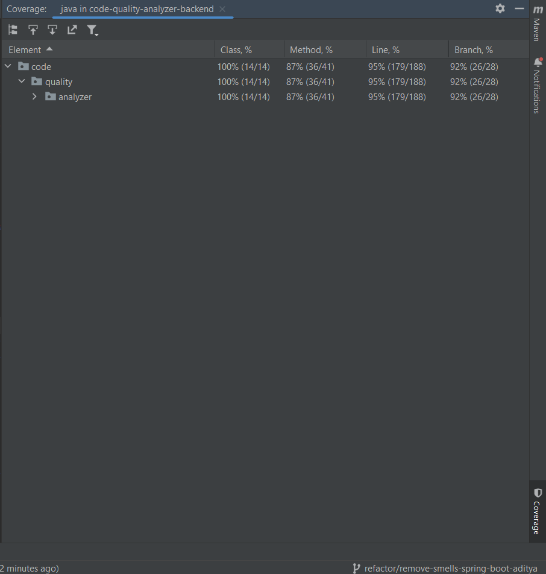
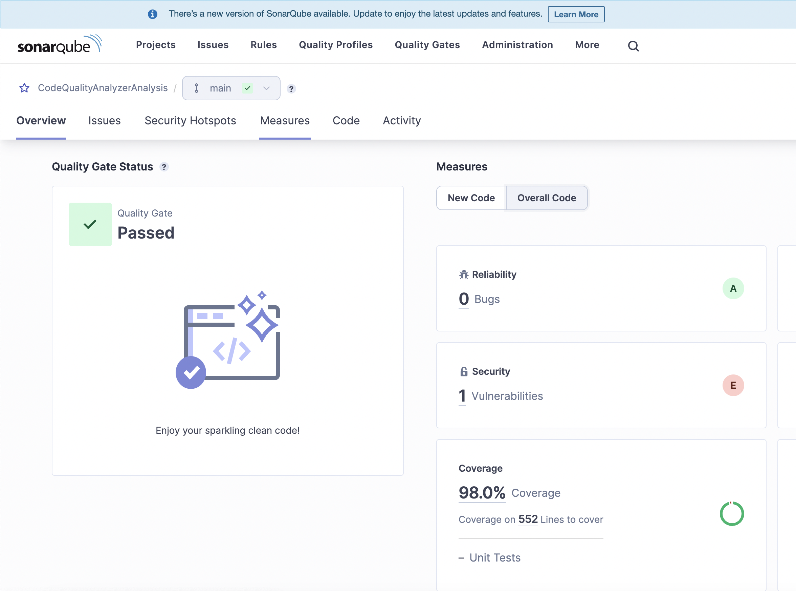
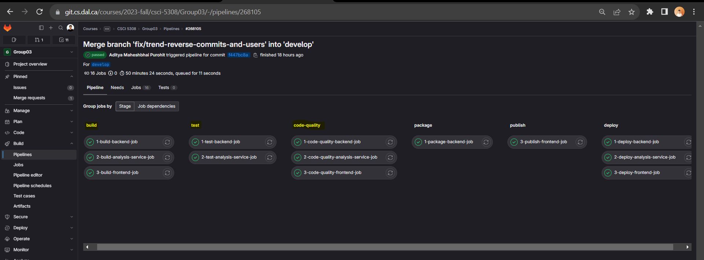

# Code Quality Report Analyzer

Deployed Version: http://csci5308vm3.research.cs.dal.ca/


# Table of content:
### 1. [Dependencies](#item-one)
### 2. [Build and Deployment Instructions](#item-two)
### 3. [Usage Scenario](#item-three)
### 4. [Refactored Smells](#item-four)
### 5. [Test Coverage](#item-five)
### 6. [Pipeline](#item-six)

<!-- headings -->
<a id="item-one"></a>
# Dependencies

## Git

    sudo apt-get update 
    sudo apt-get install git
    
## NodeJs

   Refer: https://nodejs.org/en/download, to install depending upon your OS flavour. Below is for Ubuntu.

    sudo apt-get install nodejs

## Serve
This will be used to run the production build of react app

     sudo npm install -g serve
## Maven
For creating the jar file for Spring boot app.

    sudo apt update
    sudo apt install maven
    mvn -v
## JDK 17
For running the jar file for Spring boot app.

    sudo apt install openjdk-17-jdk
## Python

   Refer: https://www.python.org/downloads/, to install depending upon your OS flavour. Below is for Ubuntu.

    sudo apt-get install python3.12
    
## Docker
Below are the instructions for Ubuntu. For other flavours of OS please check: https://docs.docker.com/get-docker/
1.  Set up Docker's  `apt`  repository.
    
    ```bash
    # Add Docker's official GPG key:
    sudo apt-get update
    sudo apt-get install ca-certificates curl gnupg
    sudo install -m 0755 -d /etc/apt/keyrings
    curl -fsSL https://download.docker.com/linux/ubuntu/gpg | sudo gpg --dearmor -o /etc/apt/keyrings/docker.gpg
    sudo chmod a+r /etc/apt/keyrings/docker.gpg
    
    # Add the repository to Apt sources:
    echo \
      "deb [arch=$(dpkg --print-architecture) signed-by=/etc/apt/keyrings/docker.gpg] https://download.docker.com/linux/ubuntu \
      $(. /etc/os-release && echo "$VERSION_CODENAME") stable" | \
      sudo tee /etc/apt/sources.list.d/docker.list > /dev/null
    sudo apt-get update
    ```
    
2.  Install the Docker packages.

    ```sudo apt-get install docker-ce docker-ce-cli containerd.io docker-buildx-plugin docker-compose-plugin```
    

3. Verify that the Docker Engine installation is successful by running the  `hello-world`  image.

	```sudo docker run hello-world```

Reference: https://docs.docker.com/engine/install/ubuntu/#install-using-the-repository

## Other Dependencies
[React Frontend Dependencies](code-quality-analyzer-frontend/package.json)

[Spring Boot Backend Dependencies](code-quality-analyzer-backend/pom.xml)

[Django Backend Dependencies](code_quality_analyzer_analysis/requirements.txt)

For code smell analysis: 
DesigniteJava Enterprise. Version 2.4.3.0 - https://www.designite-tools.com/


<!-- headings -->
<a id="item-two"></a>
# Build and Deployment Instructions

There are 3 parts of this system and all of them need to be built and deployed, before the system can work end-to-end. (React, Spring Boot and Django app)

## Pre-req: clone the repository

    git clone https://git.cs.dal.ca/courses/2023-fall/csci-5308/Group03
    cd Group03
If prompted for credentials, please enter your gitlab username and password.

## Frontend - React

Go to the frontend folder before starting build and deploy instructions. Run the below command from the root directory of the cloned repository.

    cd code-quality-analyzer-frontend

### Build
#### Docker Build
To create a docker image for the react app run the docker build command as shown below:

    docker build -t frontend-react-app .

#### Normal Build
Step-1: Install Dependencies using npm install:

    npm install

Step-2: Run the below command to create production-ready build:

    npm run build

This builds the app for production to the `build` folder.  
It correctly bundles React in production mode and optimizes the build for the best performance.

The build is minified and the filenames include the hashes. (Reference: https://create-react-app.dev/docs/getting-started#npm-run-build-or-yarn-build)

### Run/Deploy
#### with Docker

    docker run -d -p 80:3000 --restart=always --name frontend-container frontend-react-app
#### without Docker
To run/deploy the frontend app, run the following command:

    serve -s build -p 80
This will use the production build that we created in the previous step.

The frontend can be accessed using: http://localhost:80 now.

## Backend 1 - Spring Boot

> Note: Dockerized version of Spring Boot app is not here supported due the node-locked enterprise key of DesigniteJava.

Go to the spring boot folder before starting build and deploy instructions. Run the below command from the root directory of the cloned repository.

    cd code-quality-analyzer-backend

### Build
Run the below command to create a jar file:

    mvn package

This will create a `code-quality-analyzer-backend-0.0.1-SNAPSHOT.jar` file in the folder `./code-quality-analyzer-backend/target/`

### Run/Deploy

To run/deploy the spring boot app locally, run the following command:

    java -cp app.jar:"./lib/DesigniteJava.jar" org.springframework.boot.loader.JarLauncher

There is a DesigniteJava.jar dependency which needs to be mentioned while running our spring boot application. This type of set-up is needed due to the node-lock premium key of DesigniteJava Enterprise tool. Make sure to activate the DesigniteJava tool using the command:

    java -jar DesigniteJava.jar -r <lic_key>

The Spring Boot app can be accessed using: http://localhost:8080 now.

## Backend 2 - Django

Go to the django folder before starting build and deploy instructions. Run the below command from the root directory of the cloned repository.

    cd code_quality_analyzer_analysis

#### Docker Build

    docker build -t backend-django-app .

#### Normal Build

We will just install the python modules required for this Django application using the below command. We don't have any specific command to create a build for Django apps.

    pip install -r requirements.txt

### Run/Deploy

#### with docker
Here, the `/home/adityapurohit27/Group03/code-quality-analyzer-backend/target` will change as per your own cloned repository path.

    docker run -d -p 8000:8000 --restart=always -v /home/adityapurohit27/Group03/code-quality-analyzer-backend/target:/home/adityapurohit27/Group03/code-quality-analyzer-backend/target --name backend-django-container backend-django-app

#### without docker

To run/deploy the Django app locally, run the following command:

    python manage.py runserver

The Django app can be accessed using: http://localhost:8000 now.

> Note: If facing connectivity issues between these 3 apps. Modify the below 3 sections.
> 
> React app: `.env.production` file REACT_APP_BACKEND_URL=[give valid spring boot app URL]
> 
> Spring Boot app: `application.properties` file analysis.service.base.url=[give valid django app URL]
> 
> Django app: `settings.py` file ALLOWED_HOSTS = ["csci5308vm3.research.cs.dal.ca","localhost", (add your host)]

<!-- headings -->
<a id="item-three"></a>
# Usage Scenario

<!-- headings -->
<a id="item-four"></a>
# Refactored Smells

<!-- headings -->
<a id="item-five"></a>
# Test Coverage

### Spring Boot - 95% Line Coverage.
commit id - https://git.cs.dal.ca/courses/2023-fall/csci-5308/Group03/-/commit/f85b977b9fe5be1a37b64393cdb3efaaf18ff138


### Django - 98% Line Coverage.
commit id - https://git.cs.dal.ca/courses/2023-fall/csci-5308/Group03/-/commit/f447bc8a8f1f37a3e3ea605d98bcc3460ca69a65


<!-- headings -->
<a id="item-six"></a>
# Pipeline
Build & code quality stage is added for Spring Boot, Django and React.

Test stage is added for Spring Boot and Django only.



Deployment will only happen for master and develop branch commits/MRs.
